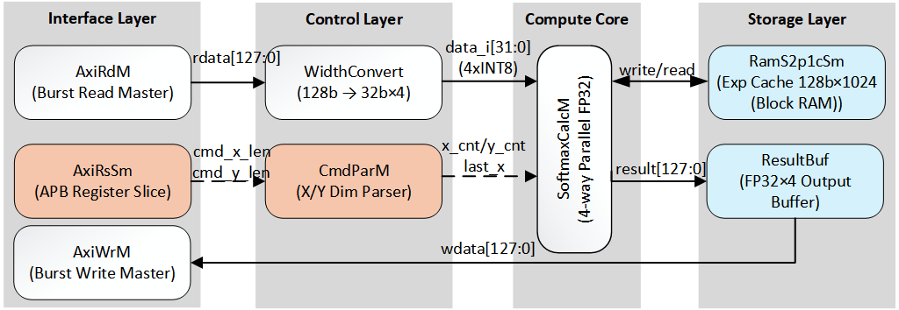
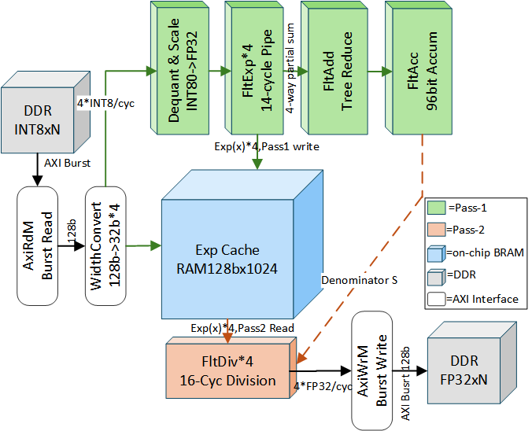
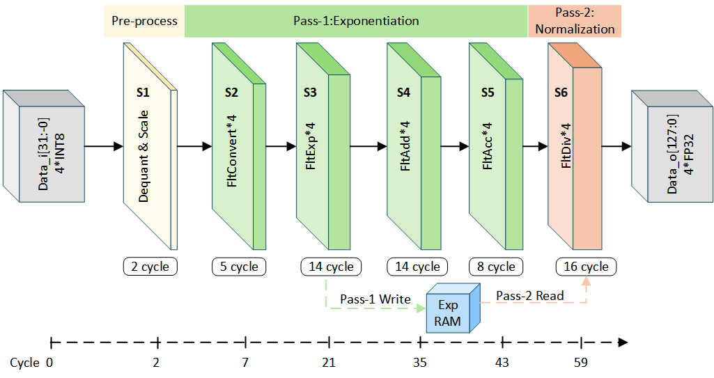
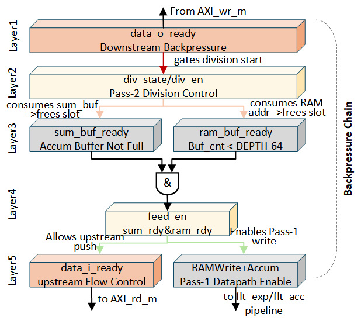

# QuadPipe: A Low-Error High-Throughput Softmax Accelerator for FPGA

[](https://github.com/SpinalHDL/SpinalHDL)
[](https://www.scala-lang.org/)
[](LICENSE)

**QuadPipe** is an open-source, high-throughput Softmax hardware accelerator designed for FPGA-based large language model (LLM) inference. Implemented in SpinalHDL, it delivers 4 FP32 results per cycle with a lightweight resource footprint and validated numerical precision down to the 10⁻¹¹–10⁻¹⁰ MAE range.

## Table of Contents

- [Overview](#overview)
- [Key Features](#key-features)
- [Architecture](#architecture)
- [Pipeline & Dataflow](#pipeline--dataflow)
- [Performance](#performance)
- [Project Structure](#project-structure)
- [Prerequisites](#prerequisites)
- [Quick Start](#quick-start)
- [Configuration](#configuration)
- [Verification](#verification)
- [Citation](#citation)

## Overview

In Transformer-based LLM inference, Softmax transitions from a minor classification post-processing step to a core operator: it acts on the N×N attention score matrix with O(N²) complexity, requires a global denominator reduction, and invokes both exponential and division — two expensive transcendental/iterative operations. On FPGA platforms, efficient Softmax acceleration faces three critical bottlenecks:

1. **Numerical drift in long sequences**: Standard FP32/FP16 accumulators suffer severe rounding error accumulation when summing thousands of exponential terms.
2. **Pipeline bubbles from variable-length vectors**: Fixed-parallelism pipelines need software pre-padding or mask control for misaligned tails, degrading hardware utilization.
3. **Memory bandwidth vs. compute density imbalance**: Frequent per-vector command configuration and non-contiguous memory access constrain system throughput under large batch processing.

QuadPipe addresses all three challenges with three synergistic design techniques integrated into a single unified pipeline — without resorting to fragile software workarounds.

## Key Features

### 1. Q48.47 Extended-Precision Accumulation (96-bit)

The denominator summation path employs a Q48.47 fixed-point accumulator (48 integer bits + 47 fractional bits, 96-bit effective width). This compresses the per-addition rounding error bound from O(2⁻²⁴) under FP32 to O(2⁻⁴⁷). The entire system consumes only 8 DSP slices.

Board-level measurements show MAE consistently in the 10⁻¹¹–10⁻¹⁰ range across all tested sequence lengths (N ∈ {128, 512, 1024, 2048}), with a ~4-order-of-magnitude safety margin above the 10⁻⁶ engineering threshold. At N=2048, denominator error is reduced by 87.59% compared to standard FP32 accumulation.

### 2. Hardware Boundary-Agnostic Processing

Variable-length vectors (where N is not a multiple of 4) are handled natively in hardware by automatically inserting NEG_INF into invalid tail slots. Because e⁻∞ = 0, these padding elements contribute nothing to the denominator and do not alter the Softmax result — but they eliminate the need for software-side length detection, data reorganization, and explicit mask control.

Measured effective element throughput improves by up to 6.49% over software pre-padding (at N=1025), with batch latency reduced by up to 5.98%.

### 3. X–Y Dual-Dimensional Batch Scheduling & Cross-Precision Datapath

The command parser supports one-shot configuration of X (vector length, up to 1024) and Y (batch count, up to 65,536), replacing per-vector command issuance with per-batch scheduling and eliminating the host-side configuration bottleneck.

A cross-precision datapath uses INT8 loading (1/4 the bandwidth of FP32), FP32 core computation, and FP32 writeback, balancing interface efficiency with arithmetic precision.

### 4. Multi-Level Backpressure Closed-Loop

A top-down backpressure chain unifies the AXI output interface, division normalization stage, on-chip RAM consumption, and input feed: congestion propagates linearly from the downstream consumer upward, and recovery opens each stage in reverse order. The system guarantees it will only block waiting for the output sink — internal deadlock is structurally impossible.

## Architecture

QuadPipe is organized into four layers: **Interface**, **Control**, **Computation**, and **Storage**.



**Figure 1**: Top-level layered architecture and module responsibilities. Solid lines represent the data path (AXI Read Master → Width Converter → Softmax Compute Core → RAM / Result Buffer → AXI Write Master). Dashed lines represent the control path (AXI Register Slice → Command Parser → Softmax Compute Core).

### Interface Layer
- **AxiRdM**: AXI4 burst read master — fetches INT8 input vectors from DDR.
- **AxiWrM**: AXI4 burst write master — writes FP32 results back to DDR.
- **AxiRsSm**: AXI register slice — decouples timing between result buffer and write master.

### Control Layer
- **CmdParM**: Command parser — converts host-programmed `cmd_x_len`, `cmd_y_len`, scale factor, and base addresses into vector-lifecycle signals (`x_cnt`, `last_x`, `last_y`) that drive the entire data plane.
- **WidthConvert**: Width converter — splits each 128-bit AXI read beat (16 INT8 elements) into four consecutive 32-bit words (4 INT8 elements each), matching the compute core's per-cycle consumption granularity.

### Computation Layer
- **SoftmaxCalcM**: The compute core — a 4-way parallel, 6-stage deeply-pipelined datapath covering dequantization, INT8→FP32 conversion, exponential approximation, tree reduction, extended-precision accumulation, and normalization division.

### Storage Layer
- **RamS2p1cSm**: Exponent cache RAM (128b × 1024) — stores Pass-1 exponential results for Pass-2 readback.
- **ResultBuf**: Result buffer (128b × 32) — aligns division output to the external backpressure domain.

## Pipeline & Dataflow

### Two-Pass Dataflow

Softmax inherently requires a global denominator S = Σeˣ before any output can be normalized. QuadPipe uses a two-pass strategy that reuses a single set of exponential units:



**Figure 2**: Two-pass dataflow and storage reuse. **Pass-1** (upper branch) computes exponentials and accumulates the denominator; each 4-element exponential result is written to the on-chip exponent cache while simultaneously fed into the reduction tree and Q48.47 accumulator. **Pass-2** (lower branch) reads cached exponentials back from RAM and performs 4-way parallel normalization division using the now-ready global denominator S.

This design trades a modest BRAM cost (14 BRAMs total) for halving the exponential unit count and keeping the pipeline regularly structured.

### 6-Stage Deep Pipeline



**Figure 3**: Compute core pipeline stages and latency allocation. The 6 sequential stages (S1–S6) perform dequantization & scaling, fixed-to-float conversion, exponential approximation, 4-way reduction, cross-cycle accumulation, and normalization division respectively, with latencies of 2, 5, 14, 14, 8, and 16 cycles. Cumulative first-result latency is 59 cycles. Once the pipeline is full, steady-state throughput reaches 4 FP32 results per cycle.

The exponent cache bypass loop (bottom of Figure 3) connects S3 and S6, forming a write-then-readback closed loop within the same compute core.

### Backpressure Control Closed-Loop



**Figure 4**: Backpressure chain and control signal propagation. Arrow colors indicate pressure direction: red = external backpressure, orange = buffer release, green = upstream grant. The chain starts at `data_o_ready` from the output side, gates the division state machine, throttles RAM/buffer consumption, and ultimately controls `data_i_ready` to the input side — forming a single coherent closed loop.

## Performance

### Resource Utilization (Xilinx Kintex-7 325T)

| Resource | Usage | Percentage |
|---|---|---|
| LUT | 9,455 | 4.72% |
| FF | 7,453 | 1.82% |
| DSP | 8 | 0.95% |
| BRAM | 14 | 3.15% |

### Throughput & Latency

| Metric | Value |
|---|---|
| Max Frequency (timing-closed) | 150 MHz |
| First-Result Latency | 59 cycles |
| Steady-State Throughput | 4 elements/cycle |
| Peak Throughput | 600M elements/s |
| Max Vector Length (X) | 1,024 |
| Max Batch Size (Y) | 65,536 |

### Numerical Accuracy (vs. FP64 Reference)

| Sequence Length N | RTL MAE (mean) | RTL MAE (max) | Meets 10⁻⁶ Threshold |
|---|---|---|---|
| 128 | 2.92×10⁻¹⁰ | 3.56×10⁻¹⁰ | Yes |
| 512 | 1.14×10⁻¹⁰ | 1.56×10⁻¹⁰ | Yes |
| 1024 | 4.32×10⁻¹¹ | 5.61×10⁻¹¹ | Yes |
| 2048 | 2.47×10⁻¹¹ | 3.34×10⁻¹¹ | Yes |

> At N=2048, Q48.47 accumulation reduces denominator error by **87.59%** over standard FP32 accumulation, and MAE decreases monotonically with increasing N rather than hitting a precision floor.

### Variable-Length Efficiency (hw_auto_pad vs. sw_pre_pad)

| Length N | Throughput Gain | Latency Reduction |
|---|---|---|
| 127 | — | — |
| 511 | +5.96% | −5.47% |
| 1025 | **+6.49%** | **−5.98%** |
| 2049 | +0.76% | −0.79% |

> Hardware boundary-agnostic processing achieves consistent gains for medium-to-long vectors. The gain profile follows an inverted-U shape, peaking at N=1025 where padding overhead is maximized relative to effective computation.

## Project Structure

```
QuadPipe/
├── build.sbt                          # SBT build definition
├── build.sc                           # Mill build definition (alternative)
├── hw/
│   ├── spinal/
│   │   └── softmax/
│   │       ├── QuadPipe.scala         # Top-level integration
│   │       ├── QuadPipeCocotbGen.scala # Parameterized Verilog generation entry
│   │       ├── axi/                   # AXI interface modules
│   │       │   ├── AxiRdM.scala       #   AXI4 read master (burst read from DDR)
│   │       │   ├── AxiWrM.scala       #   AXI4 write master (burst write to DDR)
│   │       │   ├── AxiRsSm.scala      #   AXI register slice (timing decoupling)
│   │       │   └── CmdParM.scala      #   Command parser (X-Y batch scheduling)
│   │       ├── core/                  # Computation core modules
│   │       │   ├── SoftmaxCalcM.scala #   Softmax compute core (6-stage pipeline)
│   │       │   ├── WidthConvert.scala #   128b→32b width converter
│   │       │   ├── RamS2p1cSm.scala   #   Exponent cache RAM (128b×1024)
│   │       │   └── ResultBuf.scala    #   Result buffer (128b×32)
│   │       ├── fp/                    # Floating-point arithmetic units
│   │       │   ├── FltCompat.scala    #   Compatible wrappers (FltConvert/FltExp/FltAdd/FltAcc/FltDiv)
│   │       │   ├── FltExpWrapper.scala#   Exponential approximation (LUT + polynomial)
│   │       │   ├── FltExpCcm.scala    #   Exponential coefficient/LUT module
│   │       │   ├── FltExpE2a.scala    #   Exponential intermediate transform
│   │       │   ├── FltExpRecomb.scala #   Exponential recombination
│   │       │   ├── FltExpSpecialcase.scala # Exponential special-value handler
│   │       │   ├── FltAccum.scala     #   Q48.47 extended-precision accumulator core
│   │       │   ├── FltAccumFltToFix.scala # Float-to-fixed conversion for accumulation
│   │       │   ├── FltAddSubLogic.scala   # Add/sub unified logic
│   │       │   ├── FltAlignAdd.scala  #   Alignment + addition
│   │       │   ├── FltAlignment.scala #   Exponent alignment control
│   │       │   ├── FltDivWrapper.scala#   Division wrapper (normalization stage)
│   │       │   ├── FltDivMant.scala   #   Division mantissa path
│   │       │   ├── FltFixToFltConv.scala  # Fixed-point to FP32 conversion
│   │       │   ├── FltToFixConv.scala #   FP32 to fixed-point conversion
│   │       │   ├── FltDsp48e2Wrapper.scala # DSP48E2 primitive wrapper
│   │       │   └── FltDsp48e1Wrapper.scala # DSP48E1 primitive wrapper
│   │       └── util/                  # Utility modules
│   │           ├── FltDelay.scala     #   Generic delay chain
│   │           ├── FltMux4.scala      #   4-way multiplexer
│   │           ├── FltShiftMsbFirst.scala  # MSB-first shifter
│   │           ├── FltLeadZeroEncode.scala # Leading-zero encoder
│   │           ├── FltRenormAndRoundLogic.scala # Renormalization & rounding
│   │           ├── FltRoundBit.scala  #   Rounding bit calculation
│   │           ├── FltSpecialDetect.scala   # Special-value detection
│   │           └── FltAccumBitEncode.scala  # Accumulation bit encoding
│   ├── spinal_test/
│   │   └── softmax/                   # ScalaTest-based unit/integration tests
│   ├── verilog/                       # Reference Verilog sources (DPU UVM DSP48)
│   ├── vhdl/                          # Reference VHDL sources
│   └── gen/                           # Generated Verilog output directory
├── images/                            # Architecture diagrams
│   ├── 3-1.png                        #   Top-level layered architecture
│   ├── 3-2.png                        #   Two-pass dataflow
│   ├── 3-3.png                        #   Compute core pipeline stages
│   └── 3-4.png                        #   Backpressure control chain
└── project/                           # SBT plugin configuration
```

## Prerequisites

| Tool | Version | Notes |
|---|---|---|
| JDK | 17+ | |
| SBT | 1.10.x | Primary build tool |
| Scala | 2.13.14 | Managed by SBT |
| SpinalHDL | 1.12.0 | Declared in `build.sbt` |

Optional tools for simulation and FPGA implementation:

| Tool | Purpose |
|---|---|
| Verilator | Cocotb-based RTL simulation |
| Python 3.8+ (with cocotb) | Co-simulation testbench |
| Vivado | Synthesis, place & route, bitstream generation |

## Quick Start

### 1. Clone the Repository

```bash
git clone <repository-url>
cd QuadPipe
```

### 2. Compile

```bash
sbt compile
```

This compiles all SpinalHDL sources under `hw/spinal/softmax/`.

### 3. Generate Verilog

Generate the synthesizable Verilog netlist to `hw/gen/QuadPipe.v`:

```bash
sbt "runMain softmax.QuadPipe"
```

To output to a custom directory:

```bash
sbt "runMain softmax.QuadPipeCocotbGen <output-dir> <filename.v>"
```

Example:

```bash
sbt "runMain softmax.QuadPipeCocotbGen /tmp/quadpipe_out QuadPipe.v"
```

### 4. Run Unit Tests

```bash
sbt test
```

This runs all ScalaTest-based unit and integration tests for floating-point modules, AXI interfaces, compute core, and control logic.

## Configuration

QuadPipe is configured at elaboration time through SpinalHDL parameters on the `QuadPipe` class:

| Parameter | Default | Description |
|---|---|---|
| `axiIdWidth` | 6 | AXI ID signal width |
| `axiIdLoadId` | 0 | AXI read channel ID |
| `axiIdSaveId` | 0 | AXI write channel ID |
| `axiAddrWidth` | 32 | AXI address bus width |
| `axiLenWidth` | 8 | AXI burst length width |
| `axiDataWidth` | 128 | AXI data bus width |
| `sfmDsp48Ver` | `"DSP48E2"` | DSP primitive version (`"DSP48E1"` or `"DSP48E2"`) |

At runtime, the accelerator is controlled via a register interface:

| Register | Width | Description |
|---|---|---|
| `reg_sm_cmd_x_len` | 12 | Vector length (N elements per vector) |
| `reg_sm_cmd_y_len` | 16 | Batch size (number of vectors) |
| `reg_sm_cmd_scale` | 5 | Dequantization scale factor s (recommended s ≥ 4) |
| `reg_sm_cmd_offset` | 32 | Input offset value |
| `reg_sm_cmd_src_addr` | 32 | AXI source address for INT8 input data |
| `reg_sm_cmd_dst_addr` | 32 | AXI destination address for FP32 output data |
| `reg_sm_cmd_valid` | 1 | Command strobe (pulse to start batch) |
| `reg_sm_cmd_done` | 1 | Status: batch completed (read-only) |
| `reg_sm_cmd_done_clr` | 1 | Clear done flag |

**Typical usage flow**:
1. Write `cmd_x_len`, `cmd_y_len`, `cmd_scale`, `cmd_offset`, `cmd_src_addr`, `cmd_dst_addr`.
2. Pulse `cmd_valid` = 1.
3. Poll `cmd_done` until asserted.
4. Pulse `cmd_done_clr` to acknowledge.

## Verification

QuadPipe employs a multi-layered verification strategy:

### Unit Tests (ScalaTest)

- **Floating-point module tests** (`SoftmaxFpUtilSelfSpec`): 24 tests covering FltDelay, FltMux4, FltRoundBit, FltSpecialDetect, FltAccum, FltAddExp, FltAddSubLogic, FltAlignment, FltAlignAdd, FltDivExp, FltExpCcm, FltExpE2a, FltExpRecomb, FltExpSpecialcase, FltExpWrapper, FltDivWrapper, and more.
- **Integration tests** (`SoftmaxConvergenceSpec`): Tests for FltConvert, FltExp, FltAcc convergence against reference models.
- **System-level tests** (`SoftmaxRefactorSpec`): CmdParM, WidthConvert, AxiWrM, SoftmaxCalcM, and QuadPipe top-level tests.

Run all tests:

```bash
sbt test
```

### Cocotb Co-Simulation

For cycle-accurate verification against the original Verilog reference, a cocotb-based testbench is available. See the cocotb directory for Makefile-based simulation flows.

## Citation

If you use QuadPipe in your research, please cite:

```bibtex
@article{quadpipe2025,
  title     = {QuadPipe: A Low-Error and High-Throughput Softmax Accelerator
               for Large Model Inference on FPGA},
  author    = {},
  journal   = {},
  year      = {2025},
}
```

## License

This project is distributed under the MIT License. See [LICENSE](LICENSE) for details.
